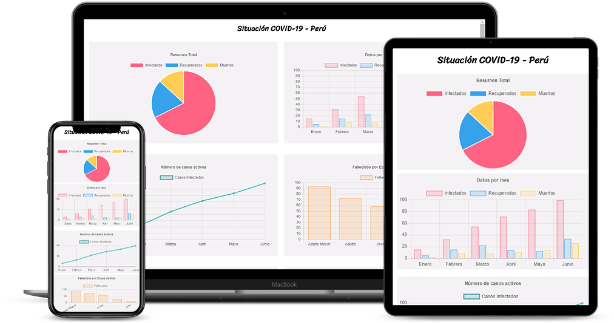

# ChartJS - PrimeFaces - PostgreSQL

Este es un proyecto con [Primefaces](https://www.primefaces.org/) version 7.0 y Base de datos [PostgreSQL](https://www.postgresql.org/). 

## Ejecute el proyecto

Ejecute el proyecto en un servidor web e ingrese a `http://localhost:8080/ChartJS_PostgreSQL/`. La aplicación mostrara la siguiente interfaz.

  